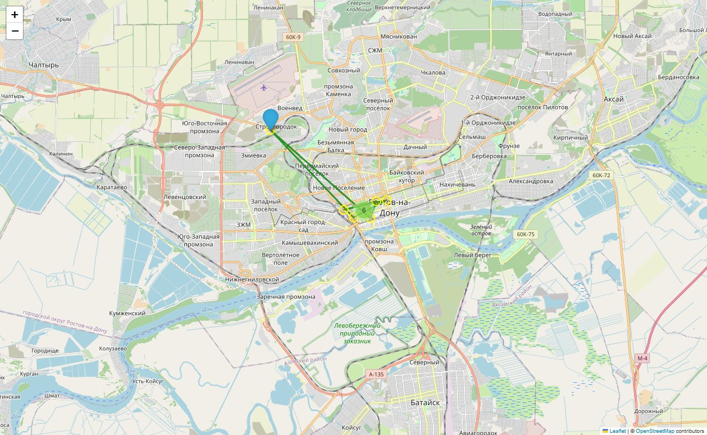
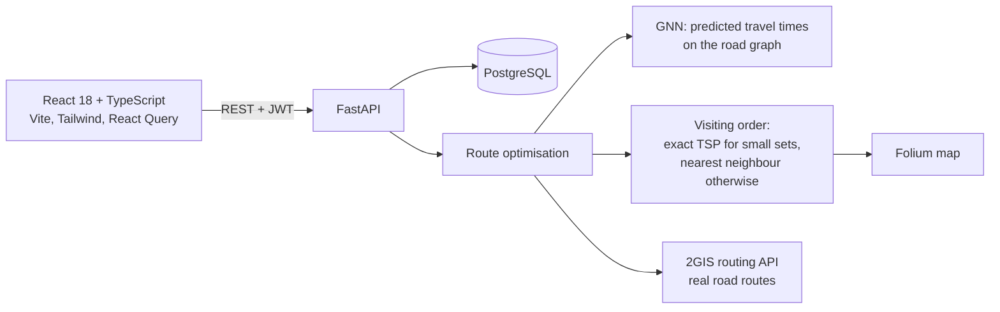
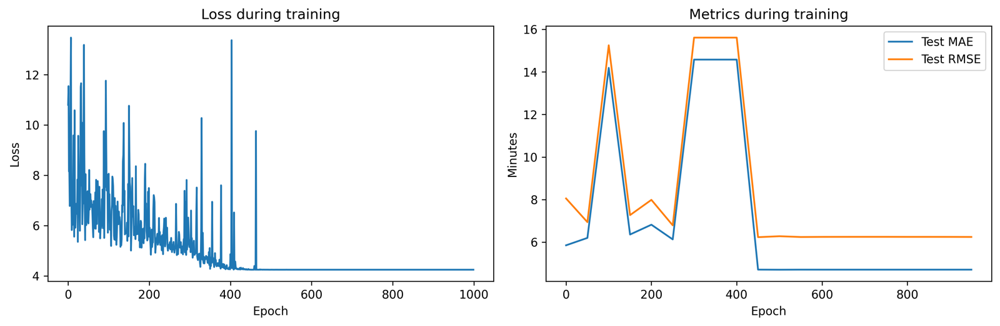

# Centr-Invest Meeting Planner

**Hackathon by Centr-Invest Bank (October 2025) — 1st place, 75,000 ₽ prize.**

A web application for bank field staff that plans client meetings: it keeps clients, meetings and tasks, shows them on a map and **builds an optimal route for the day**, where travel times between points are predicted by a **graph neural network**.



## Features

- **Meetings:** create, edit and delete meetings; meeting types with drag and drop; a mobile-first schedule view with a map.
- **Clients** with prioritisation, **tasks**, **statistics** and reports, global search, notifications, filtering and sorting.
- **Authentication** with JWT and protected routes.
- **Route optimisation** for a day of meetings (`POST /meetings/optimize-route`).

## Architecture



| Part | Path | Details |
|---|---|---|
| Frontend | [`app/src`](app/src) | React 18, TypeScript, Vite, React Router, React Query, React Hook Form, Tailwind CSS, Axios; Jest + React Testing Library |
| Backend | [`app/main.py`](app/main.py) | FastAPI, PostgreSQL (`database_schema.sql`), JWT; CRUD for clients, tasks, meetings and meeting types, statistics, route optimisation |
| Route optimisation | [`route-optimization/`](route-optimization) | PyTorch Geometric, NetworkX, Folium, 2GIS routing API |

## Route optimisation

1. Client addresses and the road network of Rostov-on-Don are turned into a graph.
2. A **graph convolutional network** (`CostGNN`, GCN layers in PyTorch Geometric) predicts the travel time of each edge; on the test set it reaches **MAE ≈ 4.7 min, RMSE ≈ 6.2 min**.
3. The predicted times form a **cost matrix** between all meeting points.
4. The visiting order is found as a **travelling-salesman problem**: exact brute force for a few points and the nearest-neighbour heuristic for larger sets.
5. Real road routes are requested from the **2GIS routing API**, and the result is drawn on an interactive **Folium** map with numbered stops and costs.



| File | Content |
|---|---|
| `route_optimizer.py` / `.ipynb` | Cost matrix, TSP solvers, route maps |
| `gnn_training.py`, `gnn_route_experiments.ipynb` | GNN training and shortest-path experiments |
| `dgis_routing_api.ipynb` | Calls to the 2GIS routing API |
| `*.pt`, `*.pth` | Trained model checkpoints |
| `*.html` | Generated route maps |

## How to run

```bash
# backend
cd app
pip install -r requirements.txt
# set DB_HOST, DB_NAME, DB_USER, DB_PASSWORD, SECRET_KEY (see env.example)
psql -h <DB_HOST> -U <DB_USER> -d meeting_db -f database_schema.sql
uvicorn main:app --reload

# frontend
npm install
npm run dev
```

The route notebooks read the 2GIS key from the `DGIS_API_KEY` environment variable.

## Development history

The commit history follows the versions of the project during the hackathon: the first React frontend (v1–v3), the mobile meetings interface (v4), the final version with the FastAPI + PostgreSQL backend and the route optimisation module. Credentials that were hard-coded during the event were replaced with environment variables before publishing.

## Team

| Member | Contribution |
|---|---|
| **Mark Bulgarov ([@MP4-Player](https://github.com/MP4-Player))** | Frontend, backend and help with the route optimisation / ML module |
| [@meeporen](https://github.com/meeporen) | Co-author |
| [@vladuliksss](https://github.com/vladuliksss) | Co-author |

## Tech stack

TypeScript · React · Vite · Tailwind CSS · React Query · Jest · Python · FastAPI · PostgreSQL · PyTorch Geometric · NetworkX · Folium · 2GIS API
